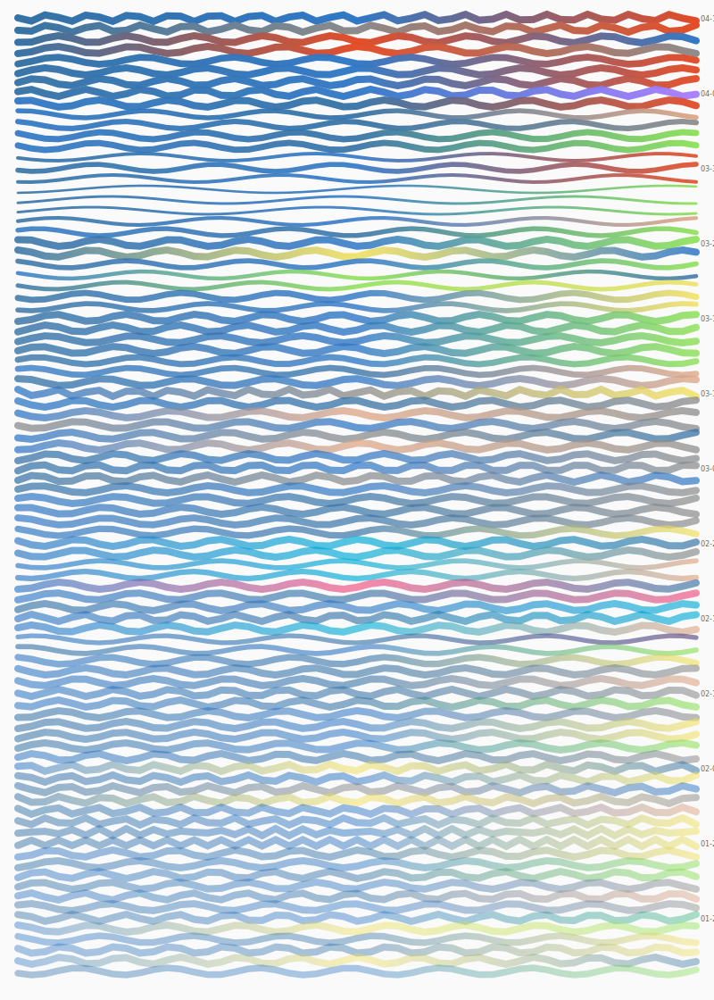
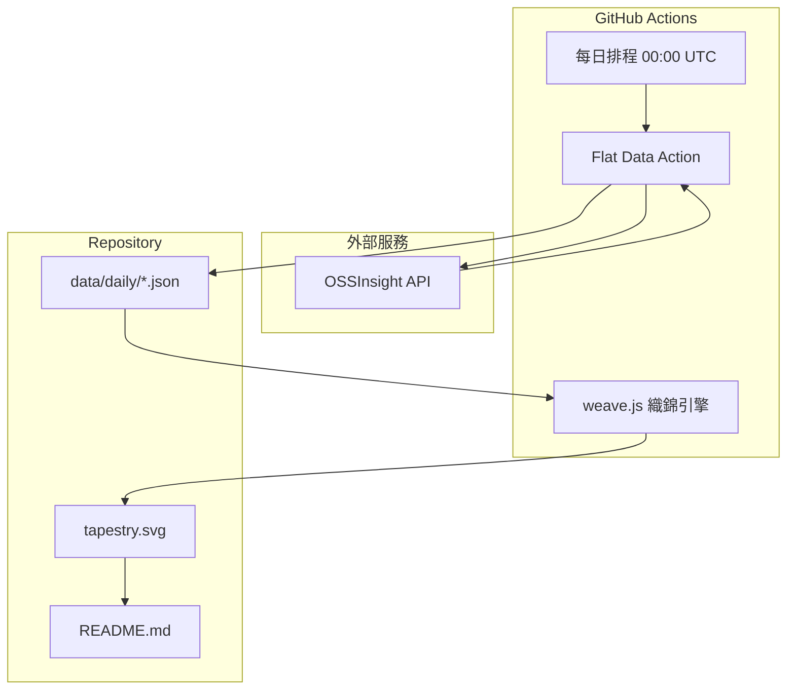

# The Data Tapestry 數據織錦

[](https://opensource.org/licenses/MIT)
[](https://githubnext.com/projects/flat-data)
[](https://nodejs.org/)

[← 回到 Muripo HQ](https://tznthou.github.io/muripo-hq/) | [English](README_EN.md)

一個關於「時間、數據與演化」的慢藝術實驗。利用 Flat Data 技術，每天自動擷取 GitHub 開源世界的脈動，並將每一天的數據轉化為一條「經緯線」。隨著時間推移，這些線條將在這裡織出一幅反映開源社群韻律的抽象藝術織錦。



> **「每一天是一根線，每筆數據是一種顏色。你的 Repo 就是織布機。」**

---

## 織錦現況

這幅織錦從零開始，每天自動織入一條新的線。

- **起織日期**：2025-12-23
- **累計天數**：持續增長中...
- **數據來源**：GitHub 每日熱門專案

### 今日熱門 Top 5

<!-- TOP10_START -->
**2026-02-03** • TypeScript 主導 • 共 7,782 ⭐

| # | Repository | Language | Stars |
|---|------------|----------|-------|
| 1 | [clawdbot/clawdbot](https://github.com/clawdbot/clawdbot) |  | ⭐ 4,278 |
| 2 | [gavrielc/nanoclaw](https://github.com/gavrielc/nanoclaw) |  | ⭐ 444 |
| 3 | [thedotmack/claude-mem](https://github.com/thedotmack/claude-mem) |  | ⭐ 495 |
| 4 | [VoltAgent/awesome-openclaw-skills](https://github.com/VoltAgent/awesome-openclaw-skills) |  | ⭐ 507 |
| 5 | [affaan-m/everything-claude-code](https://github.com/affaan-m/everything-claude-code) |  | ⭐ 363 |
<!-- TOP10_END -->

---

## 視覺美學映射

| 視覺元素 | 數據來源 | 映射邏輯 |
|---------|---------|---------|
| **線條顏色** | 主流程式語言 | Python=藍、TypeScript=深藍、Rust=橘、JavaScript=黃 |
| **色彩漸層** | 語言分布 | 前三名語言的顏色形成水平漸層 |
| **線條粗細** | 總 Star 數 | Star 越多，線條越粗 |
| **波動幅度** | 平均熱度分數 | 分數越高，波浪越明顯 |
| **透明度** | 時間遠近 | 越新的線越清晰，舊的逐漸淡化 |

---

## 系統架構



---

## 技術棧

| 技術 | 用途 | 備註 |
|------|------|------|
| [Flat Data](https://githubnext.com/projects/flat-data) | 數據自動化 | GitHub Next 專案，排程抓取與 commit |
| [OSSInsight](https://ossinsight.io/) | 數據來源 | TiDB 提供的 GitHub 趨勢 API |
| Node.js | SVG 生成 | 讀取歷史數據，計算視覺參數 |
| Deno | 後處理腳本 | Flat Data 原生支援 |
| SVG + CSS | 視覺呈現 | 內嵌動畫，織錦會「呼吸」 |

---

## 穩健性強化

本專案經過完整的 Code Review，修復了 10 項關鍵問題，確保系統穩定運作。

### 已修復問題一覽

| 優先級 | 問題 | 修復內容 |
|-------|------|---------|
| 🔴 Critical | 時區不一致 | 使用 `getTaiwanDate()` 確保台灣時間 00:00 執行時日期正確 |
| 🔴 Critical | API 錯誤未處理 | 無資料時 `Deno.exit(1)` 終止流程，避免空資料寫入 |
| 🔴 Critical | SVG 注入風險 | 新增 `escapeXml()` 函式跳脫所有動態內容 |
| 🟠 High | API Rate Limit | 偵測 API 錯誤回應並終止執行 |
| 🟠 High | Git Push 失敗 | 加入 3 次重試機制，間隔 5 秒 |
| 🟠 High | Raw 檔案無限增長 | 改用固定檔名 + 自動清理舊檔 |
| 🟠 High | 除以零風險 | 加入 `topRepos.length > 0` 檢查 |
| 🟡 Medium | 資料邊界檢查 | `safeMetrics` 提供預設值防護 |
| 🟡 Medium | Cron 註解 | 改為中文說明「每日台灣時間 00:00 執行」 |
| 🟡 Medium | README 更新失敗 | 失敗時 `process.exit(1)` 觸發通知 |
| 🟡 Medium | Workflow 假失敗 | 移除自訂 commit，讓 Flat Data 統一處理 commit & push |

### 修復成效

- ✅ **時區正確**：確保每日數據標記正確的台灣日期
- ✅ **失敗可見**：任何錯誤都會讓 Workflow 失敗並發送 GitHub 通知
- ✅ **安全強化**：防止 SVG 注入攻擊
- ✅ **自動清理**：Repository 不會因 raw 檔案無限增長
- ✅ **容錯處理**：Git push 失敗會自動重試
- ✅ **狀態正確**：GitHub Actions 不再顯示假失敗

---

## 專案結構

```
day-25-data-tapestry/
├── .github/
│   └── workflows/
│       └── flat.yml           # Flat Data 排程設定
├── data/
│   ├── daily/                 # 每日數據切片
│   │   ├── 2025-12-23.json
│   │   └── ...
│   ├── raw/                   # 原始 API 回應
│   └── latest.json            # 最新一筆數據
├── scripts/
│   ├── postprocess.ts         # Flat Data 後處理
│   └── weave.js               # SVG 織錦生成器
├── assets/                    # 靜態資源
├── tapestry.svg               # 🎨 織錦本體
├── package.json
├── LICENSE
├── README.md
└── README_EN.md
```

---

## 數據流程

### 1. 每日抓取 (Flat Data)

```yaml
# 每天 UTC 00:00 自動執行
- uses: githubocto/flat@v3
  with:
    http_url: https://api.ossinsight.io/v1/trends/repos?period=past_24_hours
    downloaded_filename: data/raw/trending-${{ github.run_id }}.json
    postprocess: scripts/postprocess.ts
```

### 2. 數據後處理 (Deno)

從 API 回應中萃取：
- 當日前 10 名熱門專案
- 主流程式語言分布
- 總 Star 數與熱度分數

### 3. 織錦生成 (Node.js)

讀取所有歷史數據，為每一天生成：
- 基於語言的漸層色彩
- 基於熱度的波浪路徑
- 基於 Star 數的線條粗細

---

## 本地開發

```bash
# 複製專案
git clone https://github.com/tznthou/day-25-data-tapestry.git
cd day-25-data-tapestry

# 手動執行織錦生成
node scripts/weave.js

# 預覽織錦
open tapestry.svg
```

---

## 隨想

### 慢藝術宣言

這不是一個能「完成」的專案。

它是一個活的系統，每天吸收世界的一點點資訊，然後把它變成一條線。一條線看不出什麼，但一個月、一年後，你會看到時間的紋理。

當你看到一條金黃色的粗線，那可能是某個 JavaScript 框架爆紅的那天。當你看到一片藍色的寧靜，那可能是 Python 社群穩定產出的證明。

### 為什麼是 GitHub Trending？

因為開源是數位時代最美的協作形式。

每一個 Star 背後，是一個開發者說：「這個專案幫助了我。」每一條線背後，是成千上萬這樣的感謝。

這幅織錦，是開源社群的心電圖。

### 冷啟動的選擇

我選擇從空白開始。

不是因為懶得補歷史數據，而是因為：每一天的線都應該是「當下」織上去的。這幅織錦不是歷史紀錄，而是持續進行的行為藝術。

你今天來看，它是這個樣子。明天再來，它會多一條線。

這就是時間的重量。

---

## 資料來源與授權

### 資料來源

- **趨勢數據**：[OSSInsight](https://ossinsight.io/) by PingCAP
- **底層資料**：GitHub 公開活動數據

### 程式碼授權

本專案採用 [MIT License](LICENSE) 授權。

這意味著：
- ✅ 可自由使用、修改、散佈
- ✅ 可用於商業用途
- ✅ 可以 fork 去追蹤你關心的任何數據
- ✅ 歡迎織出你自己的數據織錦

---

## 相關專案

- [Day-19 Stargazer Galaxy](https://github.com/tznthou/day-19-stargazer-galaxy) - 星空圖：空間上的 Star 堆疊
- [Flat Data](https://githubnext.com/projects/flat-data) - GitHub Next 的數據自動化工具
- [OSSInsight](https://ossinsight.io/) - GitHub 開源洞察平台

---

> **"Every day is a thread. Every data is a color. Your repo is the loom."**
