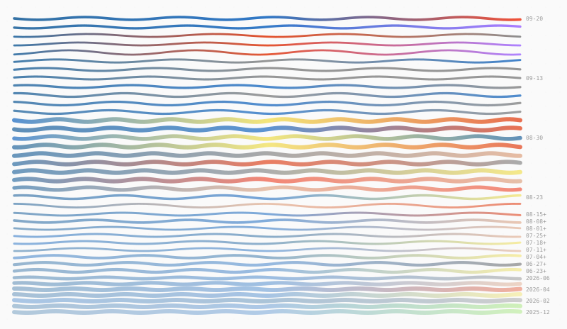
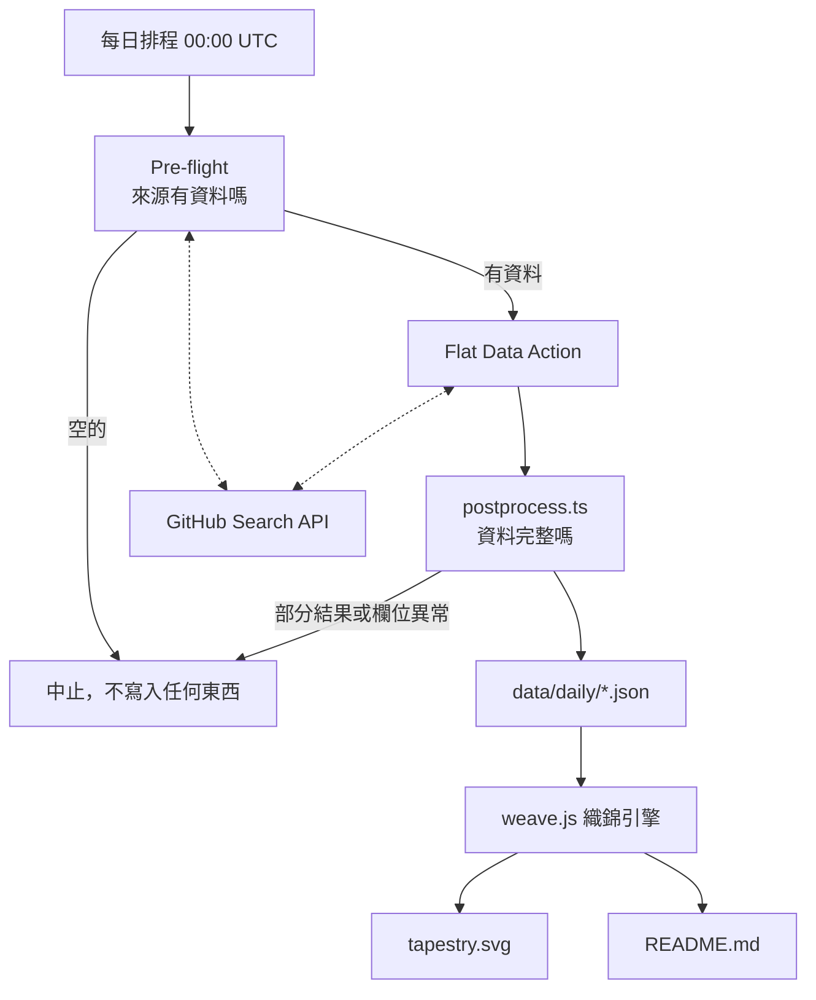

# The Data Tapestry 數據織錦

[](https://opensource.org/licenses/MIT)
[](https://githubnext.com/projects/flat-data)
[](https://nodejs.org/)

[← 回到 Muripo HQ](https://tznthou.github.io/muripo-hq/) | [English](README_EN.md)

一個關於「時間、數據與演化」的慢藝術實驗。利用 Flat Data 技術，每天自動擷取 GitHub 開源世界的脈動，並將每一天的數據轉化為一條「經緯線」。隨著時間推移，這些線條將在這裡織出一幅反映開源社群韻律的抽象藝術織錦。



> **「每一天是一根線，每筆數據是一種顏色。你的 Repo 就是織布機。」**

---

## 織錦現況

這幅織錦從零開始，每天自動織入一條新的線。近 30 天一天一線；再往前，每週併成一線、每月併成一線——越舊的記憶織得越緊，織錦才不會隨時間拉成一條無限長的布。原始資料一天都不刪。

- **起織日期**：2025-12-23
- **累計天數**：持續增長中...
- **數據來源**：GitHub Search API（近 7 天新建的專案，依星數排名）

### 織錦上的斷點

**2026-09-02 ~ 09-08 沒有線。**

原本的資料源 OSSInsight 在 9 月 1 日停止供應趨勢排名——它改成回傳 HTTP 200 但空的結果，並在回應裡自陳該指標已無法計算（他們對 GitHub 事件流的擷取率掉到基準的 0.3%，排序會變成雜訊）。排程連續空轉了八天才被發現。

換上 GitHub 官方 Search API 之後織錦恢復每日更新，但那七天補不回來：新的資料源只能回答「現在」的排名，沒有人能告訴你 9 月 3 日當下的熱門專案是什麼。

這個洞留著。慢藝術記錄的是真實發生過的時間，包括資料斷掉的那幾天。

### 今日熱門 Top 5

<!-- TOP10_START -->
**2026-09-12** • Python 主導 • 共 15,118 ⭐（repo 累計）

| # | Repository | Language | Stars (repo 累計) |
|---|------------|----------|-------|
| 1 | [ashemag/human-atlas](https://github.com/ashemag/human-atlas) |  | ⭐ 3,199 |
| 2 | [openai/NavierStokesAndEuler](https://github.com/openai/NavierStokesAndEuler) |  | ⭐ 1,774 |
| 3 | [sdli1995/dlssg_for_sm86](https://github.com/sdli1995/dlssg_for_sm86) |  | ⭐ 1,731 |
| 4 | [vinzdg/codenotch](https://github.com/vinzdg/codenotch) |  | ⭐ 1,454 |
| 5 | [EverettFish/holo-card-studio](https://github.com/EverettFish/holo-card-studio) |  | ⭐ 1,439 |
<!-- TOP10_END -->

---

## 視覺美學映射

| 視覺元素 | 數據來源 | 映射邏輯 |
|---------|---------|---------|
| **線條顏色** | 主流程式語言 | Python=藍、TypeScript=深藍、Rust=橘、JavaScript=黃 |
| **色彩漸層** | 語言分布 | 前三名語言的顏色形成水平漸層 |
| **線條粗細** | 當日十個專案的累計星數 | 星數越多，線條越粗（對數尺度，跟同期其他日子相比） |
| **波浪密度** | 當日十個專案的累計星數 | 星數越多，波峰越密 |
| **波動幅度** | 社群參與度 | 每千顆星帶來多少 fork，比值越高，波浪越明顯 |
| **透明度** | 時間遠近 | 越新的線越清晰，舊的逐漸淡化 |

### 兩種星數尺度

織錦橫跨兩個資料世代，星數的意義並不相同：

- **2026-08-23 以前**：記的是「當日新增星數」，數值落在幾十到幾千
- **2026-08-24 以後**：記的是「專案的累計星數」，數值落在數千到數十萬

兩者差了兩個數量級，混在一起比較會讓舊的日子全被壓成平線。所以每條線會標記自己屬於哪個世代，只跟同世代的線互相比較——把滑鼠移到線上，提示會告訴你這條線讀的是哪一種。README 的 Top 5 表格同樣會標明。

---

## 系統架構


```mermaid
flowchart TB
    Cron["每日排程 00:00 UTC"] --> Pre

    Pre["Pre-flight<br/>來源有資料嗎"]
    Flat["Flat Data Action"]
    Post["postprocess.ts<br/>資料完整嗎"]
    Search["GitHub Search API"]
    Stop["中止，不寫入任何東西"]

    Pre <-.-> Search
    Pre -->|空的| Stop
    Pre -->|有資料| Flat
    Flat <-.-> Search
    Flat --> Post
    Post -->|部分結果或欄位異常| Stop
    Post --> Data["data/daily/*.json"]
    Data --> Weave["weave.js 織錦引擎"]
    Weave --> SVG["tapestry.svg"]
    Weave --> README["README.md"]
```

圖上有兩道中止路徑，這是刻意的。Flat Data 的 post-job 會把它下載到的東西 commit 上去，**不管後處理有沒有失敗，而且沒有開關可以關掉**——所以擋下壞資料的位置必須在 Flat 執行「之前」。第二道防線在後處理，負責攔截格式正確但內容不完整的回應。

---

## 技術棧

| 技術 | 用途 | 備註 |
|------|------|------|
| [Flat Data](https://githubnext.com/projects/flat-data) | 數據自動化 | GitHub Next 專案，排程抓取與 commit |
| [GitHub Search API](https://docs.github.com/rest/search/search#search-repositories) | 數據來源 | 官方端點，直接讀 GitHub 自己的紀錄 |
| Node.js | SVG 生成 | 讀取歷史數據，計算視覺參數 |
| Deno | 後處理腳本 | Flat Data 原生支援 |
| SVG + CSS | 視覺呈現 | 內嵌動畫，織錦會「呼吸」 |
| Python 3 | Pre-flight 解析 JSON | 用 runner 內建的版本，是個隱式依賴 |

---

## 穩健性強化

織錦跑了大半年，兩次比較大的整修都留在這裡。

### 2026-09：資料源停止服務

**換掉上游。** OSSInsight 的趨勢排名是從 GitHub 公開事件流推導出來的，當他們的擷取率掉到基準的 0.3%，排序就只剩雜訊，於是他們選擇回傳空結果而不是回傳錯的答案。改用 GitHub 官方 Search API，直接讀 GitHub 自己的紀錄，不經過事件流。

**取樣窗口選 7 天而不是 30 天。** 30 天的窗口裡，一個爆紅的專案可以霸榜整個月，織錦會連續三十天畫同一批名字，最後拉成一條平線。7 天的名單換得夠快，紋理才出得來——實測兩種窗口的前十名完全不重疊。

**擋下失敗時的污染 commit。** Flat Data 的 post-job 無條件 commit 它下載的檔案，後處理非零退出也照推，而且沒有 opt-out。上游剛壞掉的那八天，它每晚把空回應推上 main，第一次就把 37KB 的好資料蓋成 737 bytes。現在改在 Flat 執行之前先檢查來源，沒資料就直接中止，讓 Flat 根本沒機會跑。

**攔截「格式正確但內容不完整」的回應。** 這是對抗性 review 才抓出來的洞：原本只驗「完全沒資料」，但 GitHub 在搜尋逾時的時候會設 `incomplete_results` 並只回部分排名，那個回應仍然是合法 JSON、items 陣列看起來也正常，於是下游沒有任何東西會察覺。實測餵三筆進去，後處理正常退出、workflow 全綠，那天的線就這樣安靜地錯著。現在會拒收 `incomplete_results`、拒收不足十筆、逐筆檢查欄位型別。

**移除反方向的防禦。** 原本的映射用 `|| 0` 和 `Math.max` 把缺欄位、null、字串、負數全部吞成合理值——防禦方向反了，等於把壞掉的回應加工成像樣的一天。那些寫法從來沒產生過 `NaN`，這正是它一直沒被發現的原因：下游沒有壞值可以絆倒。

**兩次請求都帶認證。** Search 端點未認證時限制每分鐘 10 次且按 IP 計算，而 GitHub Actions 的 runner 共用對外 IP，可能被別人的工作拖累。

**標明星數語意。** 換源後同一個 ⭐ 從「當日新增」變成「累計」，數字差兩個數量級，不標的話讀者會以為熱度暴增百倍。

### 2025-12：首次 Code Review

修復 11 項問題。

#### 已修復問題一覽

| 優先級 | 問題 | 修復內容 |
|-------|------|---------|
| 🔴 Critical | 時區不一致 | 使用 `getTaiwanDate()` 確保台灣時間 00:00 執行時日期正確 |
| 🔴 Critical | API 錯誤未處理 | 無資料時 `Deno.exit(1)` 終止流程，避免空資料寫入 |
| 🔴 Critical | SVG 注入風險 | 新增 `escapeXml()` 函式跳脫所有動態內容 |
| 🟠 High | API Rate Limit | 偵測 API 錯誤回應並終止執行 |
| 🟠 High | Git Push 失敗 | 加入 3 次重試機制，間隔 5 秒 |
| 🟠 High | Raw 檔案無限增長 | 改用固定檔名 + 自動清理舊檔 |
| 🟠 High | 除以零風險 | 加入 `topRepos.length > 0` 檢查 |
| 🟡 Medium | 資料邊界檢查 | `safeMetrics` 提供預設值防護 |
| 🟡 Medium | Cron 註解 | 改為中文說明「每日台灣時間 00:00 執行」 |
| 🟡 Medium | README 更新失敗 | 失敗時 `process.exit(1)` 觸發通知 |
| 🟡 Medium | Workflow 假失敗 | 移除自訂 commit，讓 Flat Data 統一處理 commit & push |

#### 修復成效

- ✅ **時區正確**：確保每日數據標記正確的台灣日期
- ✅ **失敗可見**：任何錯誤都會讓 Workflow 失敗並發送 GitHub 通知
- ✅ **安全強化**：防止 SVG 注入攻擊
- ✅ **自動清理**：Repository 不會因 raw 檔案無限增長
- ✅ **容錯處理**：Git push 失敗會自動重試
- ✅ **狀態正確**：GitHub Actions 不再顯示假失敗

---

## 專案結構

```
day-25-data-tapestry/
├── .github/
│   └── workflows/
│       └── flat.yml           # Flat Data 排程設定
├── data/
│   ├── daily/                 # 每日數據切片
│   │   ├── 2025-12-23.json
│   │   └── ...
│   ├── raw/                   # 原始 API 回應
│   └── latest.json            # 最新一筆數據
├── scripts/
│   ├── postprocess.ts         # Flat Data 後處理
│   └── weave.js               # SVG 織錦生成器
├── assets/                    # 靜態資源
├── tapestry.svg               # 🎨 織錦本體
├── package.json
├── LICENSE
├── README.md
└── README_EN.md
```

---

## 數據流程

### 1. 先確認來源還活著 (Pre-flight)

```yaml
# 沒資料就在這裡中止，不讓 Flat 有機會 commit 空的一天
- name: Pre-flight — verify the source has data
  id: preflight
  env:
    GITHUB_TOKEN: ${{ secrets.GITHUB_TOKEN }}
  run: |
    SINCE=$(date -u -d '7 days ago' +%Y-%m-%d)
    echo "since=$SINCE" >> "$GITHUB_OUTPUT"
    COUNT=$(curl -sfg -H "Authorization: Bearer $GITHUB_TOKEN" \
      "https://api.github.com/search/repositories?q=created:>$SINCE&sort=stars&order=desc&per_page=10" \
      | python3 -c 'import json,sys; print(len(json.load(sys.stdin).get("items",[])))')
    [ "$COUNT" -eq 0 ] && exit 1 || true
```

### 2. 每日抓取 (Flat Data)

```yaml
- uses: githubocto/flat@v3
  with:
    http_url: https://api.github.com/search/repositories?q=created:>${{ steps.preflight.outputs.since }}&sort=stars&order=desc&per_page=10
    authorization: Bearer ${{ secrets.GITHUB_TOKEN }}
    downloaded_filename: data/raw/trending-latest.json
    postprocess: scripts/postprocess.ts
```

### 3. 數據後處理 (Deno)

先驗證回應可用——拒收 `incomplete_results`、拒收不足十筆、逐筆檢查 `full_name` 非空與星數 fork 數為有限非負數，任何一項不過就中止，寧可缺一天也不寫進失真的資料。

通過之後萃取：
- 當日前 10 名專案（近 7 天新建，依累計星數排名）
- 主流程式語言分布
- 累計星數總和，以及社群參與度（每千顆星帶來多少 fork）

### 4. 織錦生成 (Node.js)

讀取所有歷史數據，為每一天生成：
- 基於語言的漸層色彩
- 基於社群參與度的波浪路徑
- 基於累計星數的線條粗細，只跟同一星數世代的日子比較

---

## 本地開發

```bash
# 複製專案
git clone https://github.com/tznthou/day-25-data-tapestry.git
cd day-25-data-tapestry

# 手動執行織錦生成
node scripts/weave.js

# 預覽織錦
open tapestry.svg
```

---

## 隨想

### 慢藝術宣言

這不是一個能「完成」的專案。

它是一個活的系統，每天吸收世界的一點點資訊，然後把它變成一條線。一條線看不出什麼，但一個月、一年後，你會看到時間的紋理。

當你看到一條金黃色的粗線，那可能是某個 JavaScript 框架爆紅的那天。當你看到一片藍色的寧靜，那可能是 Python 社群穩定產出的證明。

### 為什麼是 GitHub Trending？

因為開源是數位時代最美的協作形式。

每一個 Star 背後，是一個開發者說：「這個專案幫助了我。」每一條線背後，是成千上萬這樣的感謝。

這幅織錦，是開源社群的心電圖。

### 冷啟動的選擇

我選擇從空白開始。

不是因為懶得補歷史數據，而是因為：每一天的線都應該是「當下」織上去的。這幅織錦不是歷史紀錄，而是持續進行的行為藝術。

你今天來看，它是這個樣子。明天再來，它會多一條線。

這就是時間的重量。

---

## 資料來源與授權

### 資料來源

- **現行**：[GitHub Search API](https://docs.github.com/rest/search/search#search-repositories)，查詢近 7 天新建、依累計星數排序的前十名
- **2026-09-01 以前**：[OSSInsight](https://ossinsight.io/) by PingCAP，該端點已停止供應趨勢排名
- **底層資料**：GitHub 公開資料

### 程式碼授權

本專案採用 [MIT License](LICENSE) 授權。

這意味著：
- ✅ 可自由使用、修改、散佈
- ✅ 可用於商業用途
- ✅ 可以 fork 去追蹤你關心的任何數據
- ✅ 歡迎織出你自己的數據織錦

---

## 相關專案

- [Day-19 Stargazer Galaxy](https://github.com/tznthou/day-19-stargazer-galaxy) - 星空圖：空間上的 Star 堆疊
- [Flat Data](https://githubnext.com/projects/flat-data) - GitHub Next 的數據自動化工具
- [GitHub Search API 文件](https://docs.github.com/rest/search/search#search-repositories) - 現行資料來源

---

> **"Every day is a thread. Every data is a color. Your repo is the loom."**
