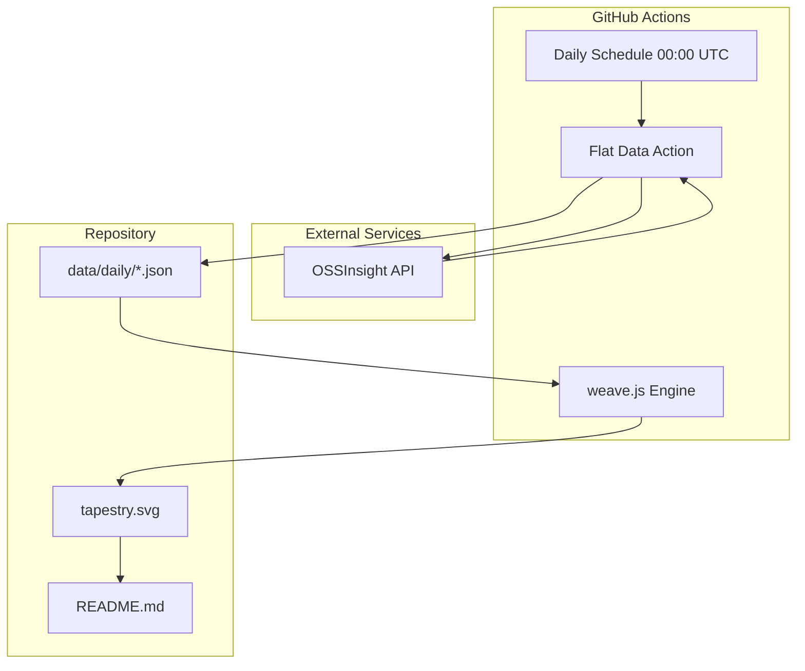

# The Data Tapestry

[](https://opensource.org/licenses/MIT)
[](https://githubnext.com/projects/flat-data)
[](https://nodejs.org/)

[← Back to Muripo HQ](https://tznthou.github.io/muripo-hq/) | [中文](README.md)

A slow art experiment about "time, data, and evolution." Using Flat Data technology, this project automatically captures a snapshot of the open source world every day, transforming each day's data into a single thread. Over time, these threads weave an abstract art tapestry reflecting the rhythm of the open source community.


> **"Every day is a thread. Every data is a color. Your repo is the loom."**

---

## Current State

This tapestry starts from nothing, automatically weaving a new thread each day.

- **First Thread**: 2025-12-23
- **Days Woven**: Growing...
- **Data Source**: Daily GitHub Trending Projects

---

## Visual-Aesthetic Mapping

| Visual Element | Data Source | Mapping Logic |
|----------------|-------------|---------------|
| **Thread Color** | Dominant Language | Python=Blue, TypeScript=Navy, Rust=Orange, JavaScript=Yellow |
| **Color Gradient** | Language Distribution | Top 3 languages form horizontal gradient |
| **Thread Width** | Total Stars | More stars = thicker thread |
| **Wave Amplitude** | Average Score | Higher score = more pronounced waves |
| **Opacity** | Recency | Newer threads are clearer, older ones fade |

---

## System Architecture



---

## Tech Stack

| Technology | Purpose | Notes |
|------------|---------|-------|
| [Flat Data](https://githubnext.com/projects/flat-data) | Data Automation | GitHub Next project for scheduled fetch & commit |
| [OSSInsight](https://ossinsight.io/) | Data Source | GitHub trends API by TiDB/PingCAP |
| Node.js | SVG Generation | Reads history, computes visual parameters |
| Deno | Post-processing | Native Flat Data support |
| SVG + CSS | Visualization | Embedded animations for "breathing" effect |

---

## Robustness & Reliability

This project underwent a comprehensive code review, fixing 10 critical issues to ensure stable operation.

### Issues Fixed

| Priority | Issue | Fix |
|----------|-------|-----|
| 🔴 Critical | Timezone Mismatch | `getTaiwanDate()` ensures correct Taiwan date when running at 00:00 |
| 🔴 Critical | API Errors Unhandled | `Deno.exit(1)` on empty data to prevent invalid writes |
| 🔴 Critical | SVG Injection Risk | Added `escapeXml()` to escape all dynamic content |
| 🟠 High | API Rate Limiting | Detect API error responses and terminate |
| 🟠 High | Git Push Failure | Added 3-retry mechanism with 5s interval |
| 🟠 High | Unbounded Raw Files | Use fixed filename + auto-cleanup old files |
| 🟠 High | Division by Zero | Added `topRepos.length > 0` check |
| 🟡 Medium | Data Boundary Check | `safeMetrics` provides default value protection |
| 🟡 Medium | Cron Comment | Updated to clearly describe Taiwan timezone |
| 🟡 Medium | README Update Failure | `process.exit(1)` on failure to trigger notifications |
| 🟡 Medium | Workflow False Failure | Removed custom commit, let Flat Data handle all commits |

### Results

- ✅ **Correct Timezone**: Daily data correctly labeled with Taiwan date
- ✅ **Visible Failures**: Any error fails the workflow and triggers GitHub notifications
- ✅ **Security Hardened**: Protected against SVG injection attacks
- ✅ **Auto Cleanup**: Repository won't grow unbounded from raw files
- ✅ **Fault Tolerance**: Git push failures auto-retry up to 3 times
- ✅ **Correct Status**: GitHub Actions no longer shows false failures

---

## Project Structure

```
day-25-data-tapestry/
├── .github/
│   └── workflows/
│       └── flat.yml           # Flat Data workflow config
├── data/
│   ├── daily/                 # Daily data slices
│   │   ├── 2025-12-23.json
│   │   └── ...
│   ├── raw/                   # Raw API responses
│   └── latest.json            # Most recent data
├── scripts/
│   ├── postprocess.ts         # Flat Data post-processor
│   └── weave.js               # SVG tapestry generator
├── assets/                    # Static assets
├── tapestry.svg               # 🎨 The Tapestry
├── package.json
├── LICENSE
├── README.md
└── README_EN.md
```

---

## Data Pipeline

### 1. Daily Fetch (Flat Data)

```yaml
# Runs daily at 00:00 UTC
- uses: githubocto/flat@v3
  with:
    http_url: https://api.ossinsight.io/v1/trends/repos?period=past_24_hours
    downloaded_filename: data/raw/trending-${{ github.run_id }}.json
    postprocess: scripts/postprocess.ts
```

### 2. Post-processing (Deno)

Extracts from API response:
- Top 10 trending repos of the day
- Programming language distribution
- Total stars and trending scores

### 3. Weaving (Node.js)

Reads all historical data, generating for each day:
- Language-based gradient colors
- Score-based wave paths
- Star-based stroke widths

---

## Local Development

```bash
# Clone the project
git clone https://github.com/tznthou/day-25-data-tapestry.git
cd day-25-data-tapestry

# Generate tapestry manually
node scripts/weave.js

# Preview
open tapestry.svg
```

---

## Reflections

### A Slow Art Manifesto

This is not a project that can be "finished."

It's a living system that absorbs a tiny piece of the world's information each day, then transforms it into a thread. One thread shows nothing, but after a month, a year, you'll see the texture of time.

When you see a thick golden thread, that might be the day a JavaScript framework went viral. When you see a calm stretch of blue, that's the steady output of the Python community.

### Why GitHub Trending?

Because open source is the most beautiful form of collaboration in the digital age.

Behind every Star is a developer saying: "This project helped me." Behind every thread are thousands of such expressions of gratitude.

This tapestry is the heartbeat of the open source community.

### The Cold Start Choice

I chose to start from nothing.

Not because I was too lazy to backfill historical data, but because: every thread should be woven in "the present moment." This tapestry is not a historical record—it's an ongoing performance art piece.

When you visit today, it looks like this. Come back tomorrow, there will be one more thread.

That's the weight of time.

---

## Data Sources & License

### Data Sources

- **Trending Data**: [OSSInsight](https://ossinsight.io/) by PingCAP
- **Underlying Data**: GitHub public activity data

### Code License

This project is licensed under the [MIT License](LICENSE).

This means:
- ✅ Free to use, modify, and distribute
- ✅ Commercial use allowed
- ✅ Fork it to track any data you care about
- ✅ Weave your own data tapestry

---

## Related Projects

- [Day-19 Stargazer Galaxy](https://github.com/tznthou/day-19-stargazer-galaxy) - Star map: spatial stacking of Stars
- [Flat Data](https://githubnext.com/projects/flat-data) - GitHub Next's data automation tool
- [OSSInsight](https://ossinsight.io/) - GitHub Open Source Insights platform

---

> **"Every day is a thread. Every data is a color. Your repo is the loom."**
