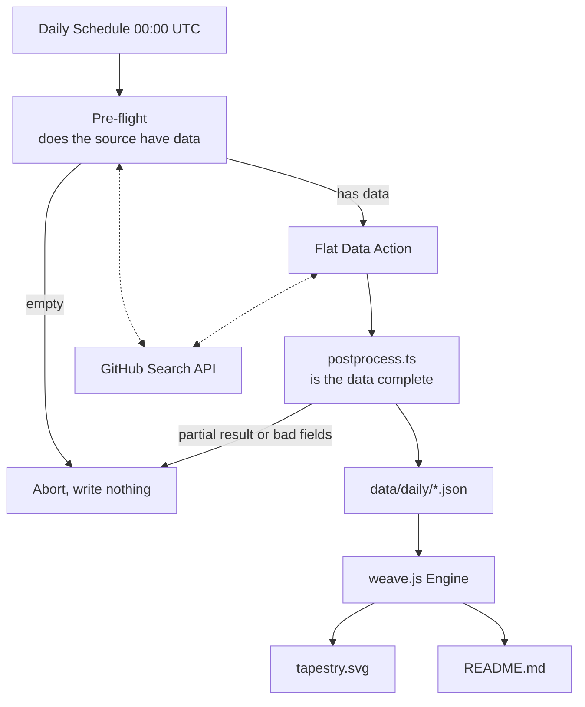

# The Data Tapestry

[](https://opensource.org/licenses/MIT)
[](https://githubnext.com/projects/flat-data)
[](https://nodejs.org/)

[← Back to Muripo HQ](https://tznthou.github.io/muripo-hq/) | [中文](README.md)

A slow art experiment about "time, data, and evolution." Using Flat Data technology, this project automatically captures a snapshot of the open source world every day, transforming each day's data into a single thread. Over time, these threads weave an abstract art tapestry reflecting the rhythm of the open source community.


> **"Every day is a thread. Every data is a color. Your repo is the loom."**

---

## Current State

This tapestry starts from nothing, automatically weaving a new thread each day. The last 30 days get one thread each; before that, threads gather into weeks, then months — older memory is woven tighter, so the cloth never stretches into an endless strip. No raw data is ever deleted.

- **First Thread**: 2025-12-23
- **Days Woven**: Growing...
- **Data Source**: GitHub Search API — repos created in the last 7 days, ranked by stars

### The Gap in the Cloth

**There are no threads for 2026-09-02 through 09-08.**

The original source, OSSInsight, stopped serving trend rankings on September 1st. It began answering HTTP 200 with an empty result and a note in the response saying the metric could no longer be computed — their capture of GitHub's event firehose had fallen to roughly 0.3% of baseline, which would have made the ordering pure noise. The scheduled job failed quietly for eight nights before anyone looked.

Switching to GitHub's own Search API brought the daily thread back, but those seven days cannot be recovered. The new source only answers questions about *now*; nobody can tell you which repos were trending on the afternoon of September 3rd.

So the gap stays. Slow art records time as it actually passed, and that includes the stretch where the data stopped arriving.

---

## Visual-Aesthetic Mapping

| Visual Element | Data Source | Mapping Logic |
|----------------|-------------|---------------|
| **Thread Color** | Dominant Language | Python=Blue, TypeScript=Navy, Rust=Orange, JavaScript=Yellow |
| **Color Gradient** | Language Distribution | Top 3 languages form horizontal gradient |
| **Thread Width** | Combined stars of the day's ten repos | More stars = thicker thread (log scale, relative to neighbouring days) |
| **Wave Density** | Combined stars of the day's ten repos | More stars = more crests |
| **Wave Amplitude** | Community engagement | Forks per thousand stars — a higher ratio makes the wave more pronounced |
| **Opacity** | Recency | Newer threads are clearer, older ones fade |

### Two Kinds of Star Count

The cloth spans two data eras, and a star does not mean the same thing in both:

- **Before 2026-08-23**: stars gained *that day*, typically in the tens to low thousands
- **From 2026-08-24**: a repo's *lifetime* star count, typically thousands to hundreds of thousands

Two orders of magnitude apart. Compare them on one scale and the older days flatten into a straight line, so each thread declares which era it belongs to and is only ever scaled against threads of the same kind. Hover a thread and the tooltip tells you which figure you are reading; the Top 5 table in the README labels it too.

---

## System Architecture


```mermaid
flowchart TB
    Cron["Daily Schedule 00:00 UTC"] --> Pre

    Pre["Pre-flight<br/>does the source have data"]
    Flat["Flat Data Action"]
    Post["postprocess.ts<br/>is the data complete"]
    Search["GitHub Search API"]
    Stop["Abort, write nothing"]

    Pre <-.-> Search
    Pre -->|empty| Stop
    Pre -->|has data| Flat
    Flat <-.-> Search
    Flat --> Post
    Post -->|partial result or bad fields| Stop
    Post --> Data["data/daily/*.json"]
    Data --> Weave["weave.js Engine"]
    Weave --> SVG["tapestry.svg"]
    Weave --> README["README.md"]
```

The two abort paths are deliberate. Flat Data's post-job commits whatever it downloaded **regardless of whether post-processing failed, and there is no way to switch that off** — so the place to stop bad data is *before* Flat runs at all. The second gate sits in post-processing and catches responses that are well-formed but incomplete.

---

## Tech Stack

| Technology | Purpose | Notes |
|------------|---------|-------|
| [Flat Data](https://githubnext.com/projects/flat-data) | Data Automation | GitHub Next project for scheduled fetch & commit |
| [GitHub Search API](https://docs.github.com/rest/search/search#search-repositories) | Data Source | Official endpoint, reads GitHub's own records |
| Node.js | SVG Generation | Reads history, computes visual parameters |
| Deno | Post-processing | Native Flat Data support |
| SVG + CSS | Visualization | Embedded animations for "breathing" effect |
| Python 3 | Pre-flight JSON parsing | Whatever ships with the runner — an implicit dependency |

---

## Robustness & Reliability

The tapestry has been running for most of a year. Two rounds of significant repair are recorded here.

### 2026-09: The Source Went Away

**Replacing the upstream.** OSSInsight derived its trend ranking from GitHub's public event firehose. Once their capture rate dropped to 0.3% of baseline the ordering was noise, and they chose to return nothing rather than return something wrong. The tapestry now reads GitHub's own Search API directly, bypassing the firehose entirely.

**A 7-day window, not 30.** Over thirty days one breakout project can hold the top slot for the whole month, and the cloth spends thirty days drawing the same names until it flattens into a line. Seven days turns the roster over fast enough for texture to appear — measured, the top ten of the two windows share no entries at all.

**Stopping the junk commits.** Flat Data's post-job commits its download unconditionally, even when post-processing exits non-zero, and offers no opt-out. Through the eight nights the upstream was broken it pushed the empty response to main every night, the first of which overwrote 37KB of good data with 737 bytes. The source is now checked *before* Flat runs, so a bad day never gets that far.

**Catching responses that are well-formed but incomplete.** This one only surfaced under adversarial review. The old validation asked "is there any data" — but when a GitHub search times out it sets `incomplete_results` and returns a partial ranking, and that response is still valid JSON with a perfectly plausible items array. Nothing downstream would notice. Feeding it three repos, post-processing exited cleanly, the workflow went green, and that day's thread would have been quietly wrong forever. It now rejects `incomplete_results`, rejects short lists, and type-checks every entry.

**Removing defenses that pointed the wrong way.** The old mapping swallowed missing fields, nulls, strings and negative numbers into plausible values via `|| 0` and `Math.max` — which turned a broken payload into a convincing day instead of a loud failure. Notably none of it ever produced `NaN`, and that is precisely why it stayed invisible: there was no bad value for anything downstream to trip over.

**Authenticating both requests.** The search endpoint allows 10 requests per minute unauthenticated and counts them per IP, and Actions runners share egress addresses — meaning someone else's job can throttle yours.

**Labelling what a star means.** After the migration the same ⭐ went from "gained today" to "lifetime total," two orders of magnitude apart. Unlabelled, it reads as the tapestry catching fire.

### 2025-12: First Code Review

Eleven issues fixed.

#### Issues Fixed

| Priority | Issue | Fix |
|----------|-------|-----|
| 🔴 Critical | Timezone Mismatch | `getTaiwanDate()` ensures correct Taiwan date when running at 00:00 |
| 🔴 Critical | API Errors Unhandled | `Deno.exit(1)` on empty data to prevent invalid writes |
| 🔴 Critical | SVG Injection Risk | Added `escapeXml()` to escape all dynamic content |
| 🟠 High | API Rate Limiting | Detect API error responses and terminate |
| 🟠 High | Git Push Failure | Added 3-retry mechanism with 5s interval |
| 🟠 High | Unbounded Raw Files | Use fixed filename + auto-cleanup old files |
| 🟠 High | Division by Zero | Added `topRepos.length > 0` check |
| 🟡 Medium | Data Boundary Check | `safeMetrics` provides default value protection |
| 🟡 Medium | Cron Comment | Updated to clearly describe Taiwan timezone |
| 🟡 Medium | README Update Failure | `process.exit(1)` on failure to trigger notifications |
| 🟡 Medium | Workflow False Failure | Removed custom commit, let Flat Data handle all commits |

#### Results

- ✅ **Correct Timezone**: Daily data correctly labeled with Taiwan date
- ✅ **Visible Failures**: Any error fails the workflow and triggers GitHub notifications
- ✅ **Security Hardened**: Protected against SVG injection attacks
- ✅ **Auto Cleanup**: Repository won't grow unbounded from raw files
- ✅ **Fault Tolerance**: Git push failures auto-retry up to 3 times
- ✅ **Correct Status**: GitHub Actions no longer shows false failures

---

## Project Structure

```
day-25-data-tapestry/
├── .github/
│   └── workflows/
│       └── flat.yml           # Flat Data workflow config
├── data/
│   ├── daily/                 # Daily data slices
│   │   ├── 2025-12-23.json
│   │   └── ...
│   ├── raw/                   # Raw API responses
│   └── latest.json            # Most recent data
├── scripts/
│   ├── postprocess.ts         # Flat Data post-processor
│   └── weave.js               # SVG tapestry generator
├── assets/                    # Static assets
├── tapestry.svg               # 🎨 The Tapestry
├── package.json
├── LICENSE
├── README.md
└── README_EN.md
```

---

## Data Pipeline

### 1. Check the Source First (Pre-flight)

```yaml
# Abort here on an empty source, so Flat never gets to commit a blank day
- name: Pre-flight — verify the source has data
  id: preflight
  env:
    GITHUB_TOKEN: ${{ secrets.GITHUB_TOKEN }}
  run: |
    SINCE=$(date -u -d '7 days ago' +%Y-%m-%d)
    echo "since=$SINCE" >> "$GITHUB_OUTPUT"
    COUNT=$(curl -sfg -H "Authorization: Bearer $GITHUB_TOKEN" \
      "https://api.github.com/search/repositories?q=created:>$SINCE&sort=stars&order=desc&per_page=10" \
      | python3 -c 'import json,sys; print(len(json.load(sys.stdin).get("items",[])))')
    [ "$COUNT" -eq 0 ] && exit 1 || true
```

### 2. Daily Fetch (Flat Data)

```yaml
- uses: githubocto/flat@v3
  with:
    http_url: https://api.github.com/search/repositories?q=created:>${{ steps.preflight.outputs.since }}&sort=stars&order=desc&per_page=10
    authorization: Bearer ${{ secrets.GITHUB_TOKEN }}
    downloaded_filename: data/raw/trending-latest.json
    postprocess: scripts/postprocess.ts
```

### 3. Post-processing (Deno)

Validates the response before touching it — rejects `incomplete_results`, rejects lists shorter than ten, and checks every entry for a non-empty `full_name` and finite non-negative counts. Any failure aborts: a missing day is recoverable, a skewed one is not.

Once it passes, it extracts:
- The day's top 10 repos (created within 7 days, ranked by lifetime stars)
- Programming language distribution
- Combined star count, and community engagement as forks per thousand stars

### 4. Weaving (Node.js)

Reads all historical data, generating for each day:
- Language-based gradient colors
- Engagement-based wave paths
- Star-based stroke widths, scaled only against days on the same star basis

---

## Local Development

```bash
# Clone the project
git clone https://github.com/tznthou/day-25-data-tapestry.git
cd day-25-data-tapestry

# Generate tapestry manually
node scripts/weave.js

# Preview
open tapestry.svg
```

---

## Reflections

### A Slow Art Manifesto

This is not a project that can be "finished."

It's a living system that absorbs a tiny piece of the world's information each day, then transforms it into a thread. One thread shows nothing, but after a month, a year, you'll see the texture of time.

When you see a thick golden thread, that might be the day a JavaScript framework went viral. When you see a calm stretch of blue, that's the steady output of the Python community.

### Why GitHub Trending?

Because open source is the most beautiful form of collaboration in the digital age.

Behind every Star is a developer saying: "This project helped me." Behind every thread are thousands of such expressions of gratitude.

This tapestry is the heartbeat of the open source community.

### The Cold Start Choice

I chose to start from nothing.

Not because I was too lazy to backfill historical data, but because: every thread should be woven in "the present moment." This tapestry is not a historical record—it's an ongoing performance art piece.

When you visit today, it looks like this. Come back tomorrow, there will be one more thread.

That's the weight of time.

---

## Data Sources & License

### Data Sources

- **Current**: [GitHub Search API](https://docs.github.com/rest/search/search#search-repositories) — top ten repos created in the last 7 days, ranked by stars
- **Before 2026-09-01**: [OSSInsight](https://ossinsight.io/) by PingCAP; that endpoint no longer serves trend rankings
- **Underlying Data**: GitHub public data

### Code License

This project is licensed under the [MIT License](LICENSE).

This means:
- ✅ Free to use, modify, and distribute
- ✅ Commercial use allowed
- ✅ Fork it to track any data you care about
- ✅ Weave your own data tapestry

---

## Related Projects

- [Day-19 Stargazer Galaxy](https://github.com/tznthou/day-19-stargazer-galaxy) - Star map: spatial stacking of Stars
- [Flat Data](https://githubnext.com/projects/flat-data) - GitHub Next's data automation tool
- [GitHub Search API docs](https://docs.github.com/rest/search/search#search-repositories) - the current data source

---

> **"Every day is a thread. Every data is a color. Your repo is the loom."**
